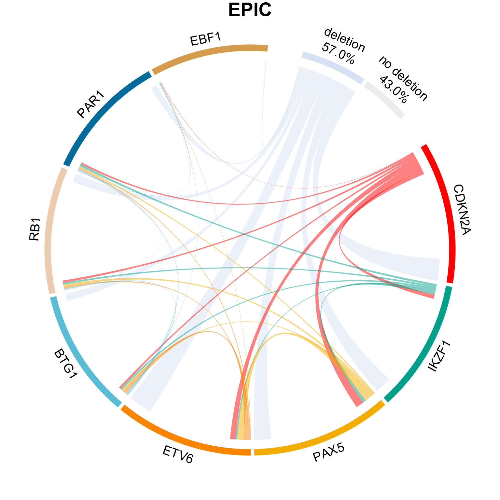

# Chord diagram

This is a script that generates a chord diagram to show the number of gene deletion of gene deletion frequency at eight commonly deleted gene regions [CDKN2A, ETV6, IKZF1, PAX5, BTG1, EBF1, RB1, and genes within the pseudoautosomal region (PAR1) of the sex chromosomes (CRLF2, CSF2RA, IL3RA)]. They were assayed in tumor DNA using multiplex ligation-dependent probe amplification (MLPA).

- Study publication: [link](https://aacrjournals.org/cebp/article/30/8/1517/671018/Epigenetic-Biomarkers-of-Prenatal-Tobacco-Smoke)
- Script: [link](./chord_diagram.Rmd)
- Output:

