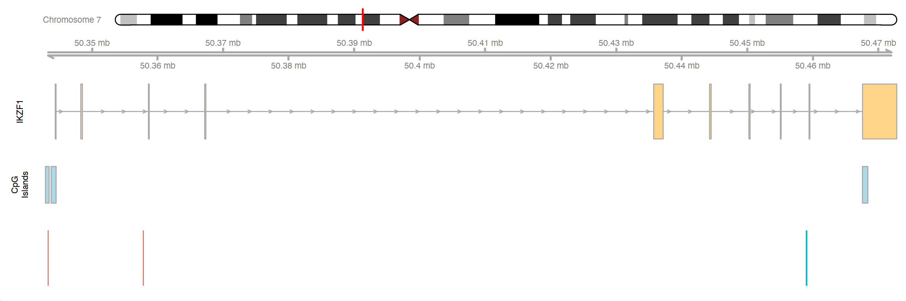
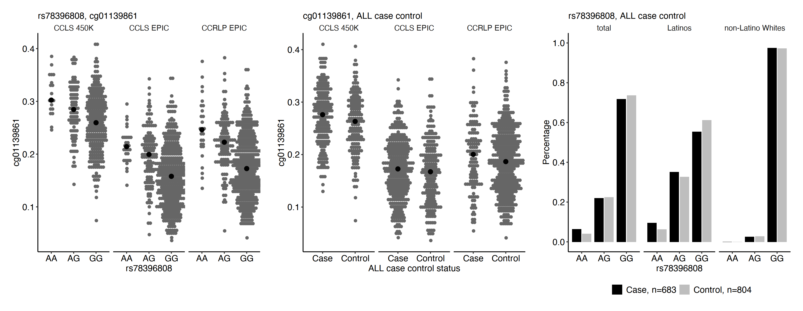
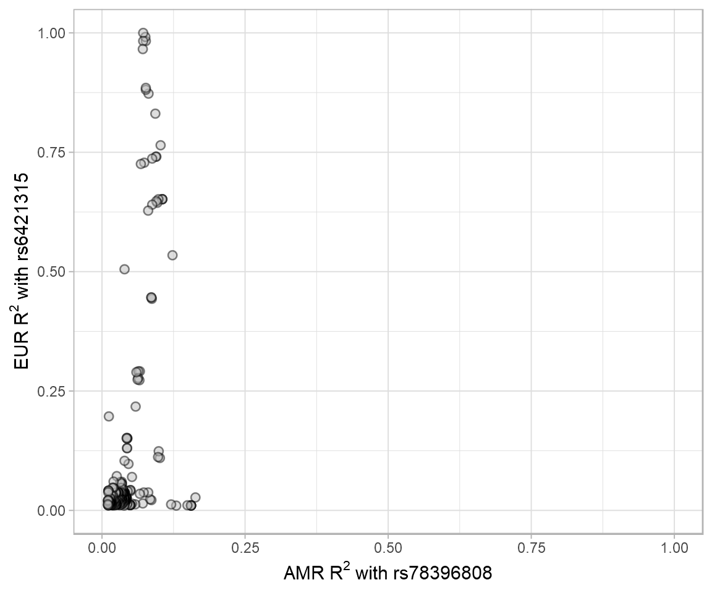

# SNP CpG association

- Study publication: [link](https://academic.oup.com/hmg/article/31/21/3741/6611023)
- [LDproxy.Rmd](./LDproxy.Rmd) shows the R^2 of the proxy variants for rs6421315 in European (EUR) populations vs. proxy variants for rs78396808 in Admixed American (AMR) populations. R^2 data were from LDproxy.
- [Gviz.Rmd](./Gviz.Rmd)  
  Visualization of the genomic location for DMP cg01139861, CpG cg10551353 and SNP rs78396808 at gene IKZF1 incorporating annotation queries to UCSC genome browser via Gviz. The top track shows the ideogram of chromosome 7 with the black rectangle indicating where gene IKZF1 is. The second track shows the genome axis, starting from position 50342500 to position 50472798 (reference build Hg19). The third track shows the IKZF1 gene transcript. The fourth track shows three CpG islands located at gene IKZF1. They are at chr7:50342895–50 343 456 (46 CpGs), chr7:50343757–50 344 519 (80 CpGs) and chr7: 50467566-50468400 (79 CpGs). The last track shows where DMP cg01139861, CpG cg10551353 and SNP rs78396808 are located. CpG cg01139861 is located in the CpG island at chr7:50342895–50343456 in the promoter region of IKZF1, and SNP rs78396808 is in an intronic region ~116 Kb downstream. CpG cg10551353 is in the 5′ UTR or the TSS1500 region of several transcripts, ~14 Kb downstream of cg01139861.

- [snp_cpg_association.Rmd](./snp_cpg_association.Rmd)
  Left panels: relationship between DNA methylation level at cg01139861 and rs78396808 genotype. Black points represent median DNA methylation levels. A is the risk allele for rs78396808. Middle panel: relationship between DNA methylation level at cg01139861 and ALL risk. Black points represent median DNA methylation levels. Right panel: rs78396808 genotype frequency in cases and controls overall, in Latinos and in non-Latino whites.

