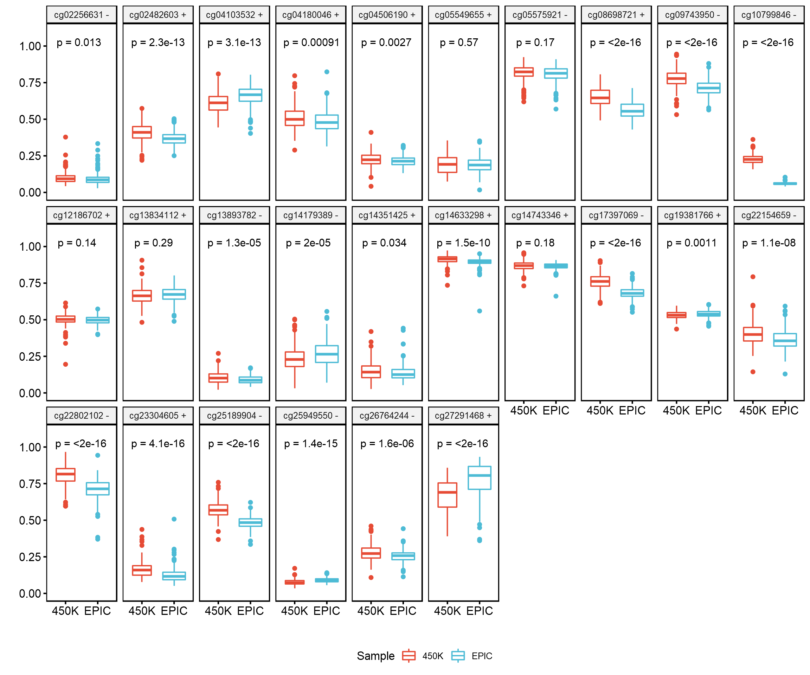

# t-test boxplot

Independent two sample t-tests comparing DNA methylation beta values for CpGs that are shared by 450K arrays and EPIC arrays and were used to calculate the polyepigenetic smoking score. The plus and minus signs in the panel labels represent whether DNA methylation beta value at this CpG is positively or negatively associated with maternal tobacco smoke. P-values were obtained from independent two sample t-tests comparing CpG beta values between the 450K dataset (N=198) and the EPIC dataset (N=284) in overall cases (N = 482).

- Study publication: [link](https://aacrjournals.org/cebp/article/30/8/1517/671018/Epigenetic-Biomarkers-of-Prenatal-Tobacco-Smoke)
- Script: [link](./compare_cpg.Rmd)
- Output:

