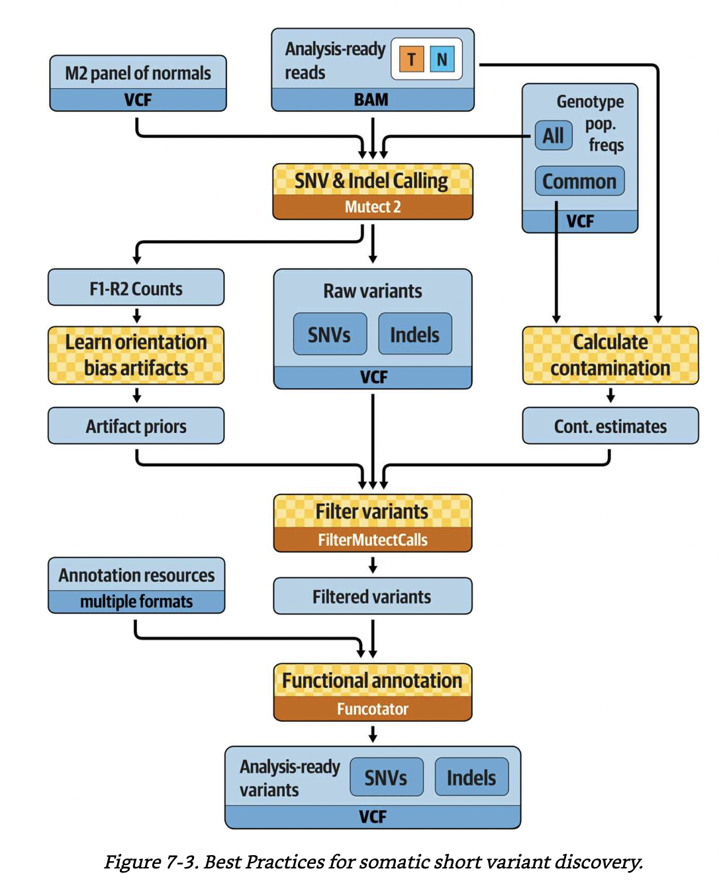

# GATK4 call somatic snvs indels  
This is an HPC workflow for calling short mutations including single nucleotide (SNA) and insertion and deletion (indel) alterations from 50 matched tumor-normal whole genome sequencing (WGS) bams from 25 childhood acute lymphoblastic leukemia cases. WGS bams were preprocessed with this [workflow](../gatk_data_preprocessing/).  

This workflow was written according to the following GATK official WDLs:  
- https://github.com/gatk-workflows/gatk4-somatic-snvs-indels  
- https://github.com/broadinstitute/gatk/tree/master/scripts/mutect2_wdl  

Check out gatk doc for more details on GATK4 Mutect2:  
- [Detailed explanation of Mutect2](https://gatk.broadinstitute.org/hc/en-us/articles/360037593851-Mutect2)  
- [Details on the deprecated pipeline](https://gatk.broadinstitute.org/hc/en-us/articles/360035889791?id=11136)
- [New pipeline](https://gatk.broadinstitute.org/hc/en-us/articles/360035531132)  
- [Mutect2 PDF document](https://github.com/broadinstitute/gatk/blob/master/docs/mutect/mutect.pdf)
- [New features and improvements](https://github.com/broadinstitute/gatk-docs/blob/master/blog-2012-to-2019/2019-01-31-New_Features_and_Improvements__in_Mutect2.md?id=23400)
- [What traditional somatic calling entails](https://gatk.broadinstitute.org/hc/en-us/articles/360035890491?id=11127)  
- [FAQ for Mutect2](https://gatk.broadinstitute.org/hc/en-us/articles/360050722212-FAQ-for-Mutect2)
  - How is the Mutect2 filter different in tumor-only mode, versus in matched-normal mode? What does it do differently in each case?  
  > In *tumor-normal* mode, Mutect2 detects germline variants using (1) the population allele frequency from the germline resource as a prior, (2) the normal reads, and (3) the allele fraction in the tumor (allele fractions near ½ are suggestive of germline hets). In *tumor-only* mode, the evidence from normal reads is missing, but it’s the same model. Additionally, in *tumor-only* mode, the powerful normal artifact filter is not available.
  > **Mutect2 uses the matched normal** to additionally **exclude rare germline variation** not captured by the germline resource and individual-specific artifacts.
  > **Mutect2 uses a germline population resource** towards evidence of alleles being germline. The simplified sites-only [gnomAD](http://gnomad.broadinstitute.org/) resource retaining allele-specific frequencies is available at [ftp://gsapubftp-anonymous@ftp.broadinstitute.org/bundle/Mutect2](ftp://gsapubftp-anonymous@ftp.broadinstitute.org/bundle/Mutect2).
  > **A panel of normals (PoN)** has a vital role that fills a gap between the matched normal and the population resource. Mutect2 uses the PoN to catch additional **sites of noise in sequencing data**, like mapping artifacts or other somewhat random but systematic artifacts of sequencing and data processing.  

  *[Interesting biostar post - How Do Heterozygotes And Somatic Mutations Manifest In Sequencing Projects](https://www.biostars.org/p/6368/)*
- [create PON](https://gatk.broadinstitute.org/hc/en-us/articles/360047219031-CreateSomaticPanelOfNormals-BETA-)
  - Create a panel of normals (PoN) containing germline and artifactual sites for use with Mutect2.
  - The tool takes multiple normal sample callsets produced by Mutect2's tumor-only mode and collates sites present in multiple samples (two by default, set by the --min-sample-count argument) into a sites-only VCF. The PoN captures common artifacts. Mutect2 then uses the PoN to filter variants at the site-level. The --max-germline-probability argument sets the threshold for possible germline variants to be included in the PoN. By default this is set to 0.5, so that likely germline events are excluded. This is usually the correct behavior as germline variants are best handled by probabilistic modeling via Mutect2's --germline-resource argument. A germline resource, such as gnomAD in the case of humans, is a much more refined tool for germline filtering than any PoN could be.
- calculate contamination: the final table tells us the likely rate of cross-sample contamination in the tumor callset. If the level of contamination of the tumor is estimated at 1.15%, with an error of 0.19%, this means that one read out of every hundred is likely to come from someone else. This percentage will effectively be our floor for detecting low-frequency somatic events; for potential variant called at or below that AF, we would have zero power to judge whether they were real or created through contamination. We will feed the table into the filtering tool so that it can take the contamination estimate properly into account. (*explanation from GITC).  

## Best practices for somatic short variant discovery. A figure from GITC.

# Step 1: Scatter interval for Mutect2 parallel calling  
- [1.1.ScatterInterval.sh](./1.1.ScatterInterval.sh)
- [1.2.Mutect2ScatterGather0.sh](./1.2.Mutect2ScatterGather0.sh)  

# Step 2: Gather results from scattered intervals  
- [1.3.MergeVCFs.sh](./1.3.MergeVCFs.sh)
- [1.4.MergeBamOuts.sh](./1.4.MergeBamOuts.sh)
- [1.5.MergeStats.sh](./1.5.MergeStats.sh)

# Step 3: Calculate contamination and learn orientation bias  
- [2.1.Contamination.sh](./2.1.Contamination.sh)  
- [2.2.OrientationBias.sh](./2.2.OrientationBias.sh)  

# Step 4: Filter alignment artifacts  
- [2.4.1.CreateBWAimage.sh](./2.4.1.CreateBWAimage.sh)  
- [2.4.2.FilterAlignmentArtifacts.sh](./2.4.2.FilterAlignmentArtifacts.sh)  

# Step 5: Filter variants  
- [2.5.Funcotate.sh](./2.5.Funcotate.sh)
- [2.6.BcftoolFilter.sh](./2.6.BcftoolFilter.sh)