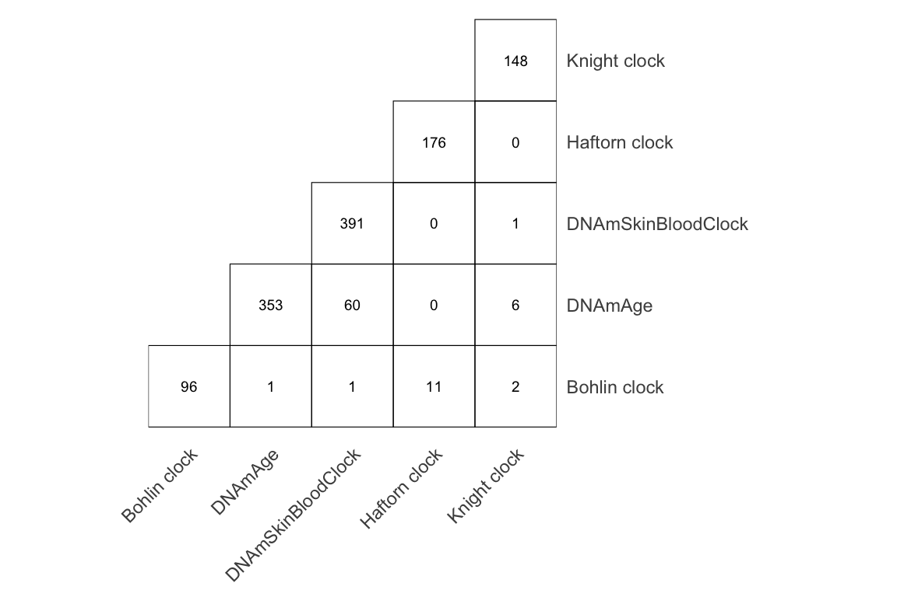
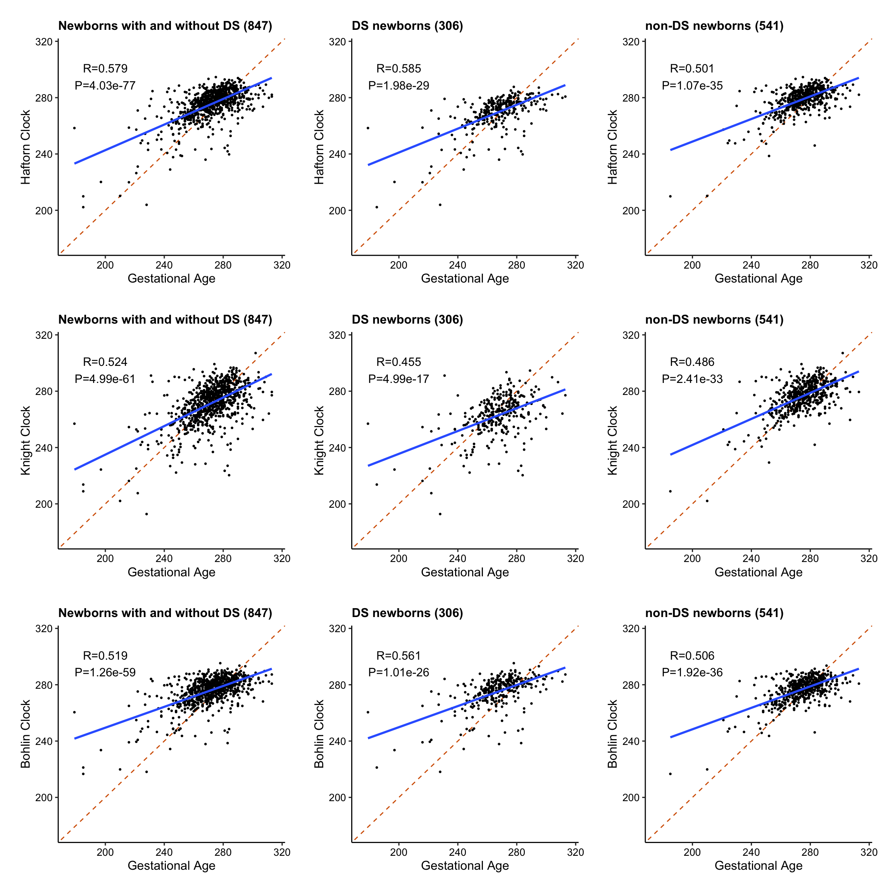
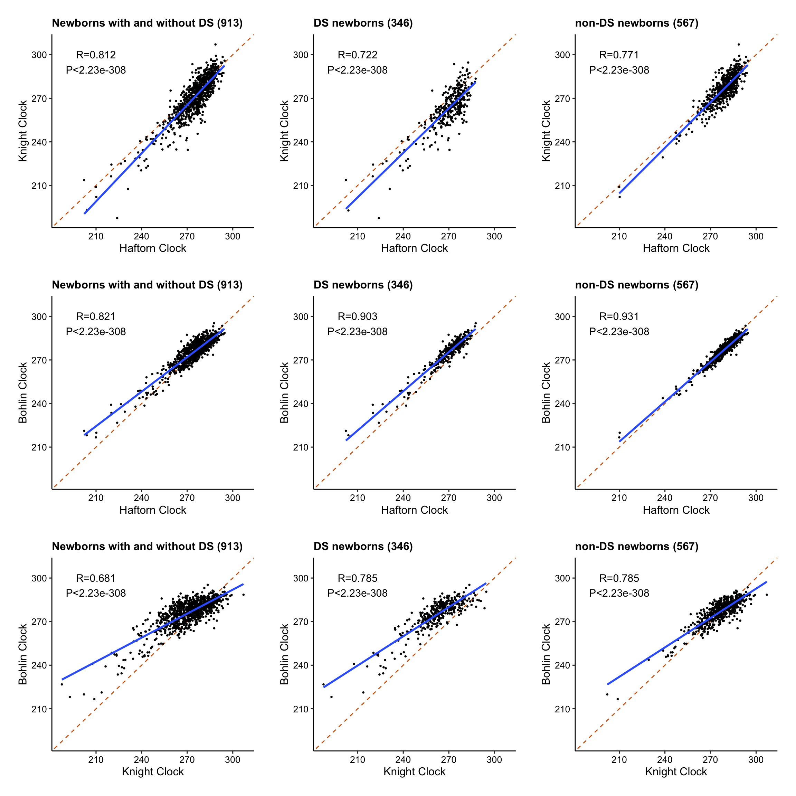

# Eigenetic clock

This is a workflow to calculate five epigenetic clocks in newborns with Down Syndrome using Illumina MethylationEPIC DNA methylation array data. These five epigenetic clocks include two epigenetic aging clocks (DNAmSkinBloodClock and pan-tissue DNAmAge) and three epigenetic gestational age clocks (Haftorn, Knight, and Bohlin).

Two epigenetic clocks: DNA methylation-based estimators of age were calculated according to the methods from [Horvath (2013)](https://genomebiology.biomedcentral.com/articles/10.1186/gb-2013-14-10-r115) (the pan-tissue DNA methylation clock (DNAmAge)) and [Horvath et al. (2018)](https://www.aging-us.com/article/101508/text) (the skin & blood clock (DNAmSkinBloodClock)). Briefly, a calibrated version of DNAmAge was calculated from a weighted combination of the DNA methylation levels of 353 CpGs and was subsequently converted back to DNAmAge; DNAmSkinBloodClock was calculated in a similar way from 391 CpGs.

Three epigenetic gestational age clocks (Bohlin et al., 2016; Haftorn et al., 2021; Knight et al., 2016): The Haftorn clock ([Haftorn et al., 2021](https://pubmed.ncbi.nlm.nih.gov/33875015/)) comprises 176 CpGs on the EPIC array. The Knight clock ([Knight et al., 2016](https://pubmed.ncbi.nlm.nih.gov/27717399/)) and the Bohlin clock ([Bohlin et al., 2016](https://www.ncbi.nlm.nih.gov/pmc/articles/PMC5054559/#MOESM1)) are composed of 148 CpGs and 96 CpGs from the 450K array, respectively. Six CpGs in the Knight clock and 8 CpGs in the Bohlin clock were absent from the EPIC array and were thus replaced with the average beta values of the 142 and 88 available clock CpGs, respectively, using the “impute.knn” function.

- Study publication: [link](https://onlinelibrary.wiley.com/doi/full/10.1111/acel.13652)
- A full list of CpGs and their weight can be found here: [link](https://github.com/XUKEREN/phd-pipeline/tree/main/epigenetic_clock)
- [epigenetic_clock.R](./epigenetic_clock.R) calculates epigenetic clocks
- [heatmap_cpg.R](./heatmap_cpg.Rmd) generates a heatmap of overlapping CpGs
- [ga_clock_corr.Rmd](./ga_clock_corr.Rmd) generates correlation plots

