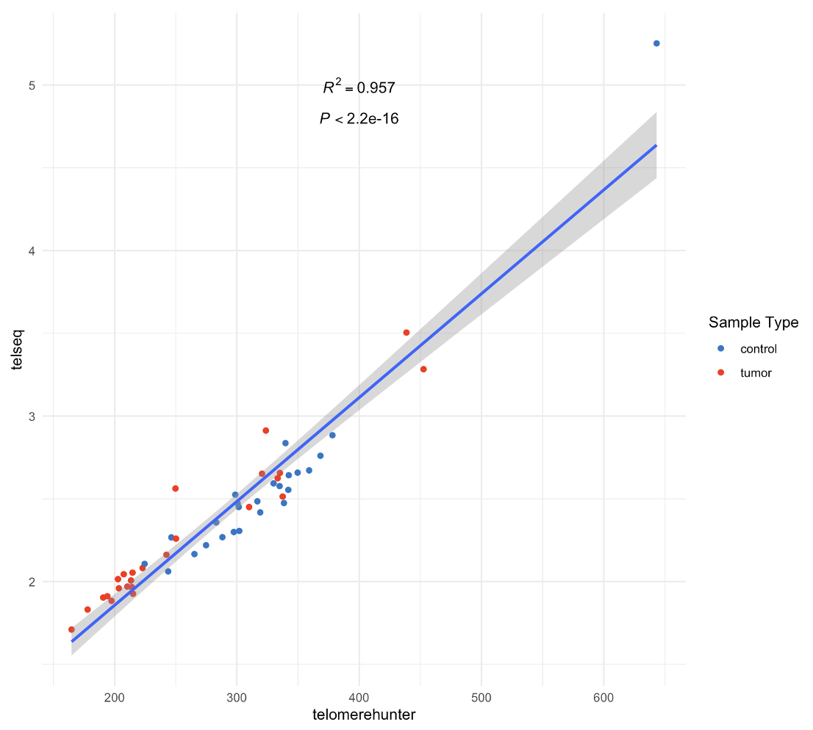

# A workflow to estimate telomere length from matched tumor normal whole genome sequencing data (BAMs)

## Background

A workflow to estimate telomere length from matched tumor-normal whole genome sequencing (WGS) data from 25 childhood acute lymphoblastic leukemia cases. WGS data were from Illumina NovaSeq 6000 Sequencing.

Two software (TelomereHunter and TelSeq) were applied to estimate telomere length from matched tumor normal WGS data (BAMs) (processed by GATK Data pre-processing for variant discovery pipeline). A correlation plot was generated to compare the results from the two software.

### TelomereHunter

- [paper](https://bmcbioinformatics.biomedcentral.com/articles/10.1186/s12859-019-2851-0)
- [software and documentation](https://www.dkfz.de/en/applied-bioinformatics/telomerehunter/telomerehunter.html)
- Telomere content was quantified using TelomereHunter using ten telomere variant repeats including TCAGGG, TGAGGG, TTGGGG, TTCGGG, TTTGGG, ATAGGG, CATGGG, CTAGGG, GTAGGG and TAAGGG.

### TelSeq

- [paper](https://academic.oup.com/nar/article/42/9/e75/1249448)
- [github](https://github.com/zd1/telseq)
- TL wsa estimated in kb using TelSeq. 7 was used as the threshold for the number of TTAGGG/CCCTAA repeats in a read for the read to be considered telomeric.

## Workflow

- step 1: [run TelomereHunter](01.TelomereHunter.sh)
- step 2: [run TelSeq](02.TelSeq.sh)
- step 3: [aggregate outputs from individual bam files](03.agg_individual_reports.sh)
- step 4: [clean aggregated tables and generate final outputs](04.summary.R)
  - for telseq, to calculate TL for each sample, we need to take a weighted average of all the read groups within each sample: https://github.com/zd1/telseq/issues/1

## Example correlation plot

- results from TelomereHunter and TelSeq had a high correlation (an example correlation plot generated from step 4)

